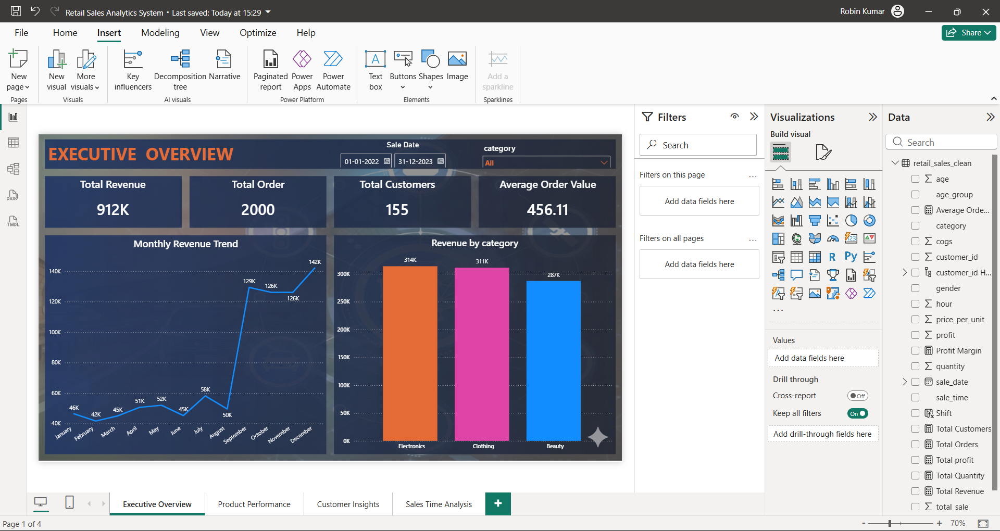
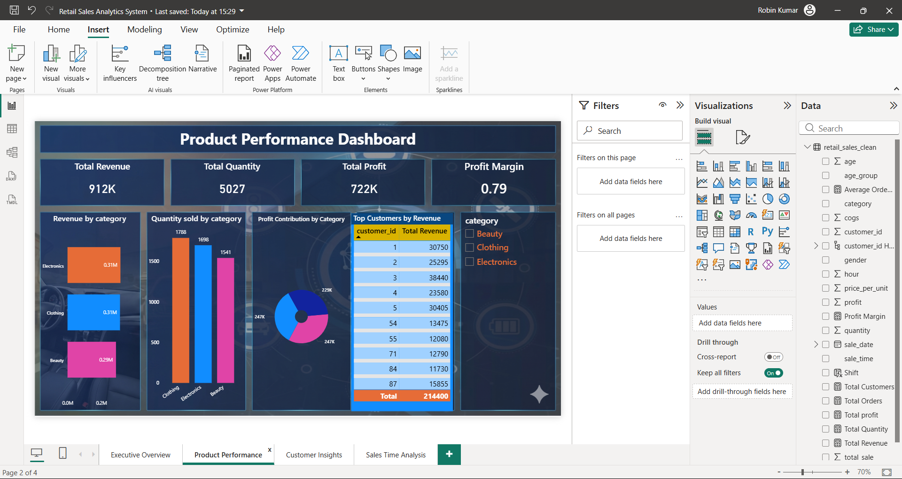
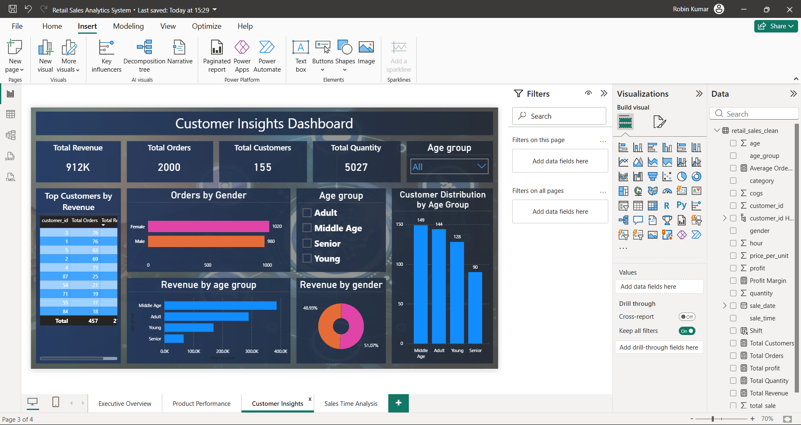
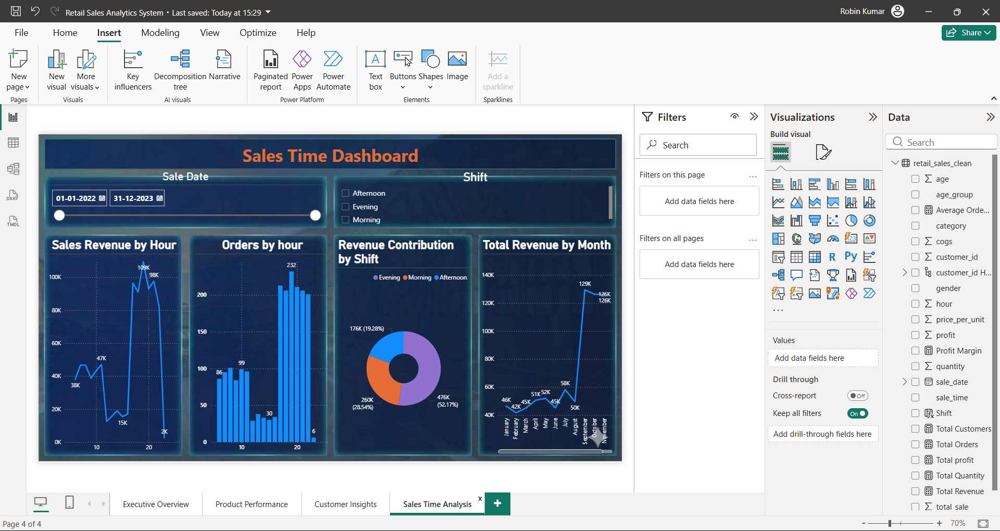

# 🛒 Retail Sales Analytics & Visualization System

> **End-to-End Data Analytics Capstone Project**  
> *Excel → Python (Pandas) → MySQL → Power BI*

[](https://python.org)
[](https://mysql.com)
[](https://powerbi.microsoft.com)
[](https://microsoft.com/excel)
[]()

---

## 📌 Project Overview

This project transforms **2,000 raw retail transactions** into a fully functional Business Intelligence system — covering the complete data analytics lifecycle from raw data ingestion to interactive executive dashboards.

Unlike typical SQL-only projects, this capstone mirrors a **real-world enterprise analytics workflow** where data passes through multiple layers: exploration, cleaning, storage, querying, and stakeholder-facing visualization.

### 🎯 Core Business Problem Solved

> *A retail business had no structured view of when sales peak, which customers drive revenue, and which categories are most profitable — leading to inefficient staffing, poor inventory planning, and untargeted marketing.*

**This system answered:**
- 📦 Which product category drives the most revenue?
- 👥 Which customer segment should marketing target?
- ⏰ When do peak sales occur — by hour, shift, and month?
- 📈 What is the monthly revenue trend across 2 years?
- 💰 Who are the top 10 customers by spending?

---

## 📊 Dashboard Snapshots

### 1️⃣ Executive Overview
> *Top-line business performance monitoring*



| KPI | Value |
|-----|-------|
| Total Revenue | **₹912K** |
| Total Orders | **2,000** |
| Total Customers | **155** |
| Average Order Value | **₹456.11** |

**Key Visual:** Monthly Revenue Trend (Jan 2022 – Dec 2023) + Revenue by Category

---

### 2️⃣ Product Performance Dashboard
> *Inventory and category-level optimization analysis*



| Metric | Value |
|--------|-------|
| Total Revenue | **₹912K** |
| Total Quantity Sold | **5,027 units** |
| Total Profit | **₹722K** |
| Profit Margin | **0.79 (79%)** |

**Visuals:** Revenue by Category · Quantity by Category · Profit Contribution · Top Customers by Revenue

**Insight:** Electronics leads in revenue; Clothing leads in quantity sold.

---

### 3️⃣ Customer Insights Dashboard
> *Customer behavior segmentation for targeted marketing*



| Segment | Orders |
|---------|--------|
| Female customers | **1,020** |
| Male customers | **980** |
| Adult (25–40) | Highest revenue contributor |
| Total unique customers | **155** |

**Visuals:** Orders by Gender · Revenue by Age Group · Customer Distribution · Top Customers

**Insight:** Female customers place more orders; Adult segment (25–40) drives the most revenue.

---

### 4️⃣ Sales Time Analysis Dashboard
> *Operational staffing and seasonal demand forecasting*



| Shift | Revenue Share |
|-------|--------------|
| Evening | **75.29%** |
| Morning | **19.29%** |
| Afternoon | **5.17%** |

**Visuals:** Sales Revenue by Hour · Orders by Hour · Revenue by Shift · Total Revenue by Month

**Insight:** Evening shift drives 75% of all revenue — critical for staffing and promotional planning.

---

## 💡 Key Business Insights Generated

```
1. 🏆 Electronics = Highest revenue category (₹311K+)
2. 🌙 Evening shift = 75.29% of total revenue → Staff up evenings
3. 👤 Adult segment (25-40) = Largest revenue contributor
4. 👩 Female customers = More orders (1,020 vs 980)
5. 📅 Nov–Dec = Revenue spike → Plan Q4 inventory early
6. 💎 Top 5 customers = ~15% of total revenue
7. 📈 Profit Margin = 79% → High-margin business
```

---

## 🏗️ Project Architecture

```
Raw CSV Dataset
      │
      ▼
┌─────────────────────────────┐
│  LAYER 1 — Excel EDA        │
│  Pivot Tables & Stats       │
└────────────┬────────────────┘
             │
             ▼
┌─────────────────────────────┐
│  LAYER 2 — Python (Pandas)  │
│  Cleaning + Feature Engg.   │
└────────────┬────────────────┘
             │
             ▼
┌─────────────────────────────┐
│  LAYER 3 — MySQL Database   │
│  Structured Storage + SQL   │
└────────────┬────────────────┘
             │
             ▼
┌─────────────────────────────┐
│  LAYER 4 — Power BI         │
│  4 Interactive Dashboards   │
└─────────────────────────────┘
```

---

## 🗂️ Dataset Structure

| Column | Type | Description |
|--------|------|-------------|
| `transaction_id` | INT (PK) | Unique transaction identifier |
| `sale_date` | DATE | Date of purchase |
| `sale_time` | TIME | Time of purchase |
| `customer_id` | INT | Unique customer ID |
| `gender` | VARCHAR | Customer gender |
| `age` | INT | Customer age |
| `category` | VARCHAR | Product category (Electronics / Clothing / Beauty) |
| `quantity` | INT | Units purchased |
| `price_per_unit` | FLOAT | Price per item |
| `cogs` | FLOAT | Cost of Goods Sold |
| `total_sale` | FLOAT | Total transaction value |

---

## 🐍 Python — Data Cleaning & Feature Engineering

```python
import pandas as pd

# Load dataset
df = pd.read_csv("retail_sales.csv")

# --- Data Cleaning ---
df = df.dropna()                          # Remove missing values
df = df.drop_duplicates()                 # Remove duplicates
df['sale_date'] = pd.to_datetime(df['sale_date'])

# --- Feature Engineering ---
df["profit"]    = df["total_sale"] - df["cogs"]

df["age_group"] = pd.cut(df["age"],
    bins=[0, 25, 40, 60, 100],
    labels=["Young", "Adult", "Middle Age", "Senior"])

df["hour"]  = pd.to_datetime(df["sale_time"]).dt.hour

df["Shift"] = df["hour"].apply(lambda h:
    "Morning"   if h < 12 else
    "Afternoon" if h <= 17 else
    "Evening")

df.to_csv("retail_sales_clean.csv", index=False)
```

**Result:** 2,000 records cleaned → 100% null-free, analysis-ready dataset with 3 new analytical features.

---

## 🗄️ MySQL — Table Schema & Key Queries

### Table Creation

```sql
CREATE TABLE retail_sales (
    transaction_id  INT PRIMARY KEY,
    sale_date       DATE,
    sale_time       TIME,
    customer_id     INT,
    gender          VARCHAR(10),
    age             INT,
    category        VARCHAR(20),
    quantity        INT,
    price_per_unit  FLOAT,
    cogs            FLOAT,
    total_sale      FLOAT
);
```

### Analytical Queries

```sql
-- Revenue by Category
SELECT category, SUM(total_sale) AS revenue
FROM retail_sales
GROUP BY category ORDER BY revenue DESC;

-- Top 5 Customers
SELECT customer_id, SUM(total_sale) AS total_spent
FROM retail_sales
GROUP BY customer_id ORDER BY total_spent DESC LIMIT 5;

-- Monthly Revenue Trend
SELECT EXTRACT(MONTH FROM sale_date) AS month,
       SUM(total_sale) AS revenue
FROM retail_sales GROUP BY month ORDER BY month;

-- Shift-Based Sales Analysis
SELECT
    CASE
        WHEN EXTRACT(HOUR FROM sale_time) < 12  THEN 'Morning'
        WHEN EXTRACT(HOUR FROM sale_time) <= 17 THEN 'Afternoon'
        ELSE 'Evening'
    END AS shift,
    COUNT(*)           AS total_orders,
    SUM(total_sale)    AS revenue
FROM retail_sales GROUP BY shift ORDER BY revenue DESC;

-- Peak Sales Hour
SELECT EXTRACT(HOUR FROM sale_time) AS hour,
       SUM(total_sale) AS revenue
FROM retail_sales GROUP BY hour ORDER BY revenue DESC;
```

> 📁 Full set of 13 SQL queries available in [`queries/retail_sales_queries.sql`](queries/retail_sales_queries.sql)

---

## 📊 Power BI — Dashboard Modules

| Dashboard | Business Purpose | Key Visuals |
|-----------|-----------------|-------------|
| **Executive Overview** | C-suite performance monitoring | Monthly Trend, Revenue by Category, KPI Cards |
| **Product Performance** | Inventory & profitability optimization | Revenue, Quantity, Profit Margin by Category |
| **Customer Insights** | Targeted marketing segmentation | Age Group, Gender, Top Customers |
| **Sales Time Analysis** | Staffing & seasonal demand planning | Hourly Sales, Shift Revenue, Monthly Trend |

**Features:** Live MySQL connection · Dynamic slicers · Cross-visual filtering · DAX measures (AOV, Profit Margin, Total Customers)

---

## 📁 Repository Structure

```
Retail-Sales-Analytics-System/
│
├── data/
│   ├── retail_sales.csv              # Raw dataset
│   └── retail_sales_clean.csv        # Cleaned dataset
│
├── notebooks/
│   └── data_cleaning.ipynb           # Python cleaning + EDA
│
├── queries/
│   └── retail_sales_queries.sql      # All 13 SQL queries
│
├── dashboards/
│   ├── executive_overview.png
│   ├── product_performance.png
│   ├── customer_insights.png
│   └── sales_time_analysis.png
│
├── powerbi/
│   └── Retail_Sales_Analytics.pbix   # Power BI report file
│
└── README.md
```

---

## 🛠️ Tech Stack

| Tool | Purpose |
|------|---------|
| Microsoft Excel | EDA, Pivot Tables, Monthly trend (TEXT formula) |
| Python 3.8+ / Pandas | Data cleaning, feature engineering |
| MySQL 8.0 | Relational storage, 13 analytical SQL queries |
| Power BI Desktop | 4 interactive dashboards, DAX measures |

---

## 👤 Author

**Robin Kumar**  
Aspiring Data Analyst · B.Tech CSE, DCRUST (2022–2026)

[](https://github.com/Robin045)
[](mailto:robinatul7@gmail.com)

---

> *"Identified that Evening shift drives 75% of total revenue and the Adult segment (25–40) is the primary revenue contributor — enabling data-driven decisions on staffing, inventory, and targeted marketing."*
